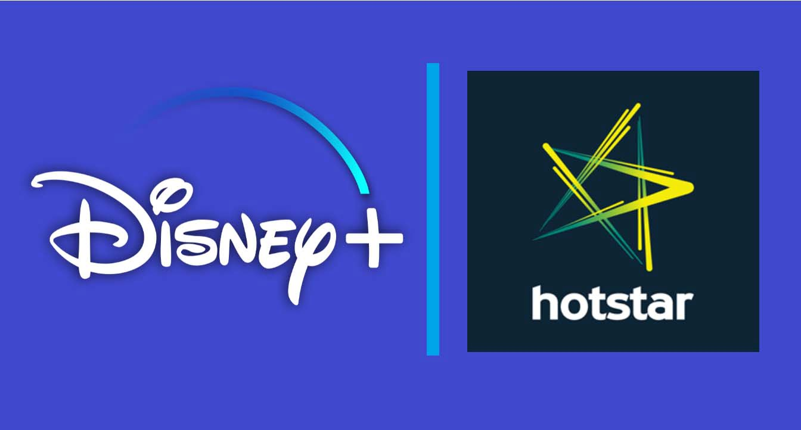

- Model CPU error

## Analysing User Watch Times and Predict the Segment (i.e. Sentiment)

#### Team Members
- Omkar Khanvilkar
- Pranav Nair
- Sujan Dutta
- Varun Tandon

Identifying customer sentiments is an important task in any business-to-customer (B2C) domain since it helps businesses to identify the areas of improvement by taking into account the interests of the users. Some of ways of identifying user sentiments include conducting a survey at regular intervals asking customers their likes, dislikes and preferences, capturing regular feedback regarding user experience etc. But, surveying customers and asking for feedback regularly can prove tedious for the users and hamper the user experience. Hence, we look at an alternate method of deducing user sentiment, by analysing the user behaviour.
  

&nbsp;

This problem focusses on one such use case pertaining to the Indian online streaming platform Disney+ Hotstar. Here we have a dataset that contains the geotagged watch time for 200,000 users who use the platform, along with a surveyed poll that represents their sentiment about the platform. This survey poll can be thought of a pop-up that appears once when the user is using the platform and surveys whether their experience on the platform has been good or not.  
Our task is to build a machine learning model that can take these user watch times and sentiments of the customers and learn to predict the sentiments for future users..

## Data Description

The dataset file for this project is hosted in the [given link](https://www.hackerearth.com/problem/machine-learning/predict-the-segment-hotstar/). 
The dataset consists of three files:
    - `train_data.json` - This is our training dataset that contains the features and target variables for 200000 users 
    - `test_data.json` - This our testing dataset that contains only the features for 100000 users. This is the data on which we shall be predicting using our ML model.
    
    
## Evaluation Metric

The evaluation metric for our problem shall be `roc_auc_score`

### Data & Models
We have converted all the models that we have trained on the dataset into pickle files (i.e. `.pkl`). These models along with all the preprocessed datasets have been stored in the given link on drive, since they cannot be pushed to GitHub due to their large file size
- Preprocessed Datasets - https://drive.google.com/drive/folders/1NDcrSaYWsN5nOA737GE1MXaFI40XUcO-?usp=sharing
- Pickle files of Models -  https://drive.google.com/drive/folders/1TmhZcSfXTNSh5WfgaQ7wzZNEpf3zfn1P?usp=sharing

### Execution
The IPython notebook should be executed on a GPU-enabled machine.

### Streamlit 
The `main.py` file should be used for running the streamlit app. It is recommended to create a separate environment when tring to run the app.
